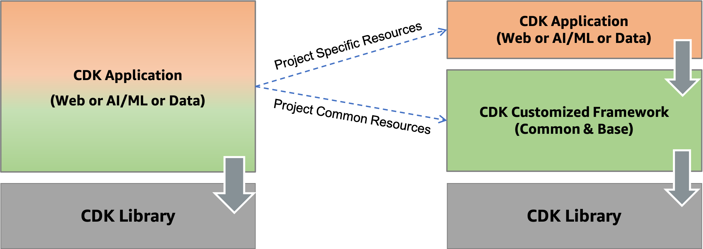
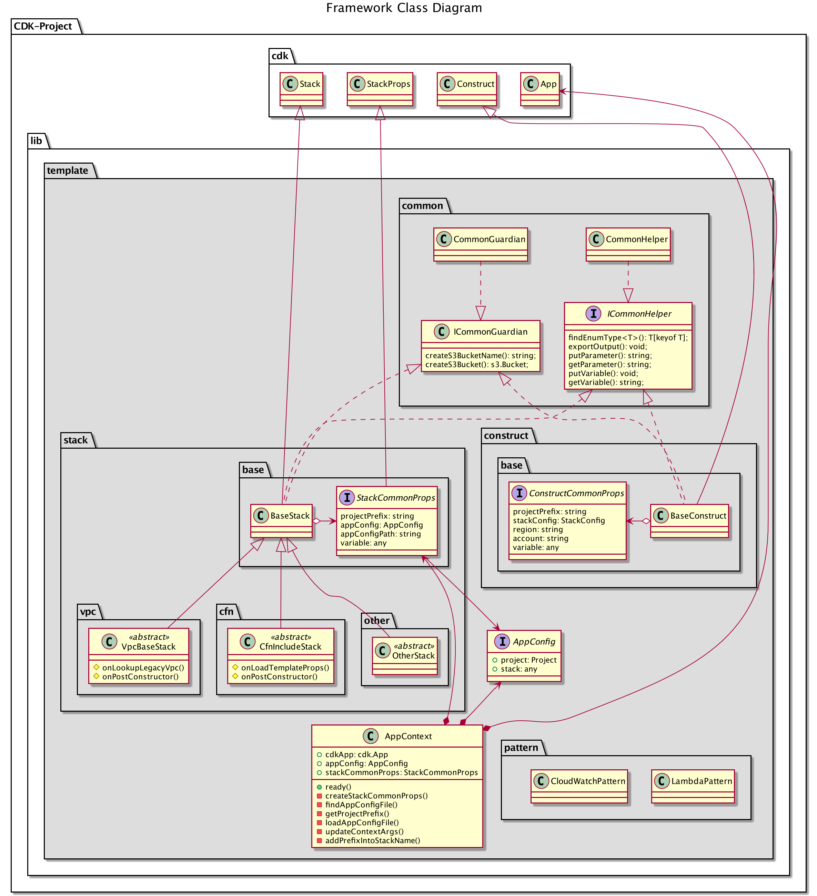

# ALA CDK shared library Templates for cloud deployment

This project is heavily based on [AWS CDK Project Template for DevOps](https://github.com/aws-samples/aws-cdk-project-template-for-devops)

The repository provides best practices and template framework for developing AWS Cloud Development Kit(CDK)-based applications effectively, quickly and collaboratively. In detail, practical approaches such as how to deploy to multi-environment, how to organize directories and how to manage dependencies between stacks will be introduced, and template codes are provided to support them. Gradually, these template codes will be further expanded to support various DevOps scenario.

This template framework suports both CDK Ver2.

## Agenda

1. [AWS CDK Introduction](#1-aws-cdk-introduction)

2. [Prerequisites](#2-prerequisites)

3. [Basic Principles](#3-basic-principles)

    3-a. [DevOps Collaboration: How to organize directory for collaboration](#3-a-devops-collaboration-how-to-organize-directory-for-collaboration)

    3-b. [Multi-Target Deployment: How to separate configuration from codes](#3-b-multi-target-deployment-how-to-separate-configuration-from-codes)

    3-c. [Stack Independence: How to manage dependency between stacks](#3-c-stack-independence-how-to-manage-dependency-between-stacks)

    3-d. [Code Reuse: How to make it a framework](#3-d-code-reuse-how-to-make-it-a-framework)

4. [Sample Stacks](#4-sample-stacks)

5. [Projects based on this framework](#5-projects-based-on-this-framework)

6. [Security](#6-security)

7. [License](#7-license)

## 1. AWS CDK Introduction

 [AWS Cloud Development Kit(CDK)](https://aws.amazon.com/cdk) is an open source software development framework to define your cloud application resources using familiar programming languages. After coding using CDK Construct and Stack, if you run it through CDK CLI, it is finally compiled and deployed through AWS CloudFormation.


 AWS CDK supports TypeScript, JavaScript, Python, Java, C#/.Net, and (in developer preview) Go. The template codes of this repository are implemented in **TypeScript**, because it clearly defines restrictions on types. Restrictions on types provide automated/powerful guide within IDE.

 Because AWS CDK is provided in a language that supports OOP(Object-Oriented Programming), it is possible to configure and deploy cloud resources in the most abstract and modern way. This repository provides a template framework by maximizing these characteristics.

### CDK Useful commands

- `npm install`     install dependencies only for Typescript
- `cdk list`        list up all stacks
- `cdk deploy`      deploy this stack to your default or specific AWS account/region
- `cdk diff`        compare deployed stack with current state
- `cdk synth`       emits the synthesized CloudFormation template
- `cdk destroy`     destroy this stack to your default or specific AWS account/region
  
### CDK Project Entry-point

 `cdk.json` in the root directory describes a entry-point file, in this repository we use **infra/app-main.ts** as the entry-point.

### CDK Useful Links

- CDK Intro: [https://docs.aws.amazon.com/cdk/latest/guide/home.html](https://docs.aws.amazon.com/cdk/latest/guide/home.html)
- CDK Getting Started: [https://docs.aws.amazon.com/cdk/latest/guide/hello_world.html](https://docs.aws.amazon.com/cdk/latest/guide/hello_world.html)
- API Reference: [https://docs.aws.amazon.com/cdk/api/latest/docs/aws-construct-library.html](https://docs.aws.amazon.com/cdk/api/latest/docs/aws-construct-library.html)
- CDK Workshop: [https://cdkworkshop.com/](https://cdkworkshop.com/)
- CDK Examples: [https://github.com/aws-samples/aws-cdk-examples](https://github.com/aws-samples/aws-cdk-examples)

## 2. Prerequisites

### AWS Account & IAM User

First of all, AWS Account and IAM User is required. IAM user's credential keys also are requried.

### Dependencies

To execute this template codes, the following modules must be installed.

- AWS CLI: aws --version
- Node.js: node --version
- AWS CDK: cdk --version
- [jq](https://stedolan.github.io/jq/): jq --version

Please refer to the kind guide in [CDK Workshop](https://cdkworkshop.com/15-prerequisites.html).

### AWS Credential

Configure your AWS credential keys using AWS CLI see ([AWS access](https://confluence.csiro.au/display/ALASD/AWS+access))

```bash
comp-login
```
or
```
prod-login
```

## 3. Basic Principles

Several principles were selected to improve DevOps efficiency through AWS CDK. Conversely, if you are considering using AWS CDK as an IaC template for a one-time deployment, there is no need to apply these principles.

### 3-a. **DevOps Collaboration**: How to organize directory for collaboration

- **Purpose**: As an IaC tool for DevOps, it is very important to organize the directory of the project so that you can collaborate by role.
- **Approach**: I recommend having a separate directory for each role within a project so that each member interacts within a fence. The following figure shows the directory structure intuitively.

```
<project base>
|-- aws
    |-- cdk.out
    |-- config            <--- project / stage / stack infrastruture configuration
    |-- infra             
        | main.ts         <--- definitions of projects stacks
        |-- stack         <--- stack definitions
    |-- lib               <--- custom CDK library extentions
    |-- node_modules
    |-- test             <--- CDK unit tests
    | .gitignore
    | .npmignore
    | .npmrc
    | cdk.json           <--- CDK entry point
    | jest.config.json
    | package-lock.json
    | package.json
    | README.md
    | tsconfig.json
```

  Although it is not an mandatory guide, it is necessary to configure this way so that development without boundaries between each other is possible. In particular, as the development paradigm shifts to serverless, the boundary between infrastructure(infra, config, lib) and business codes(app, codes, models) is disappearing.

### 3-b. **Multi-Target Deployment**: How to separate configuration from codes

- **Purpose**: Code and configuration should be separated so that they can be freely deployed to various AWS account/region without modifying the code.
- **Approach**: Prepare a json file for each distribution in `config` directory in order to isolate the configuration from the code as much as possible. The following figure shows the configuration files in `config` directory.

Because we need to ensure that a single source code is maintained, all configurations are managed in `config/app-config-[your-suffix].json`. And several files are made according to the environment you want to deploy to, and you have to choose one of them when deploying.

Each `config/app-config-[your-suffix].json file` consists of two main parts in json format.

```json
{
    "Project": {
        
    },

    "Stack": {
        
    }
}
```

#### Project Part

**Project** part describes project name and stage, and where to deploy.

The project name and stage are combined to create a unique project prefix, which is used as a prefix of all stacks.

Specifying AWS account number and region name in CDK source code causes us to modify the code per release. As a result, such information must be managed outside of the source code.

The final project part consists of:

```json
{
    "Project": {
        "Name": "HelloWorld",       <----- Essential: your project name, all stacks will be prefixed with [Project.Name+Project.Stage]
        "Stage": "Demo",            <----- Essential: your project stage, all stacks will be prefixed with [Project.Name+Project.Stage]
        "Account": "75157*******",  <----- Optional: defaults to AWS CLI account from default profile
        "Region": "eu-central-1",   <----- Optional: defaults to AWS CLI region from default profile
        "Profile": "cdk-demo"       <----- Optional: AWS Profile, keep empty string if no profile configured
    },

    "Stack": {
    }
}
```

In this example configuration, all stack names start with `HelloWorldDemo`. By setting this prefix, it is possible to deploy multiple stages to the same AWS account/region.

#### **Stack Part**

Usually a CDK project is implemented in several stacks, which have some degree of dependency on each other. **Stack** part describes detailed configuration of each stack. There is no need to define a standardized format because each stack requires different resource configurations, but the `Name` item must be declared because it is common.

A sample stack configuration consists of:

```json
{
    "Project": {
    },

    "Stack": {
        "Pipeline": {
            "Name": "Pipeline",

            "Parameters": {
                "connectionArn": "****",
                "owner": "AtlasOfLivingAustralia",
                "repo": "ala-cdk-libs",
                "branch": "develop"
            }
        },
        "RestApi": {
            "Name": "RestApi",

            "Parameters": {
                "specFile": "./specs/****.yaml",
                "integrationUrl": "https://****.ala.org.au/ws"
            }
        }
    }
}
```

#### How to select a target deployment

 Set the path of this json configuration file through an environment variable. The key name of environment variable is `APP_CONFIG`, which can be modified in `infra/main.ts` file.

```bash
export APP_CONFIG=config/app-config-demo.json
```

 Or you can select this configuration file in command line like this:

 ```bash
 cdk deploy *PipelineStack --context APP_CONFIG=config/app-config-demo.json
 ```

 Through this external configuration injection, multiple deployments(multiple account, multiple region, multiple stage) are possible without code modification.

### 3-c. **Stack Independence**: How to manage dependency between stacks

- **Purpose**: It should be possible to independently deploy each stack by removing the strong coupling between each stack.
- **Approach**: If `Output` of CloudFormation is directly referenced between stacks, a strong dependency occurs and deployment becomes difficult when there are many stacks. To solve this problem, I recommend placing a key-value registry between them and referencing each other. Of course, this method does not change that the deployment order of each stack must be respected, but once stored in the parameter store, independent deployment is possible afterwards. Luckily, AWS provides **Parameter Store** in **System Manager**, which is the best solution for this.


 For frequently used parameter store access, we provide methods to help with this in our base class.

For parameter provider: putParameter()

 ```typescript
import * as base from '../../../lib/template/stack/base/base-stack';
import { AppContext } from '../../../lib/template/app-context';

export class DataStoreStack extends base.BaseStack {

    constructor(appContext: AppContext, stackConfig: any) {
        super(appContext, stackConfig);

        const ddbTable = this.createDdbTable();
        this.putParameter('TableName', ddbTable.tableName)
    }

    ...
}
 ```

For parameter user: getParameter()

 ```typescript
import * as base from '../../../lib/template/stack/base/base-stack';
import { AppContext } from '../../../lib/template/app-context';

export class DataProcessStack extends base.BaseStack {

    constructor(appContext: AppContext, stackConfig: any) {
        super(appContext, stackConfig);

        const tableName = this.getParameter('TableName')
        
    }
}
 ```

### 3-d. **Code Reuse**: How to make it a framework

- **Purpose**: Frequently reused workloads should be abstracted and easily reused without duplication of code.
- **Approach**: Frequently used patterns and resources are provided using OOP's [template method pattern](https://en.wikipedia.org/wiki/Template_method_pattern). That is, frequently used things will be provided through the parent class, and the child class will inherit and reuse it. This is an essential approach used in the process of creating a framework.



As shown in the figure above, we can now use the framework to focus on more core business logic and reliably speed up development.

The stack and construct corresponding to the parent class are planned to be gradually expanded based on the workload or pattern that is essential. All contributors are welcome on this, so please contact me.



## 4. Sample Stacks

This section explains how to use each base class with example codes. This sample implements a typical backend service.

You can see what parent class each stack inherits from through the following full diagram.

### ALA-CDK-libs-Test-Pipeline

This stack created a CodePipeline to publish this library to the NPM repository. 

- Stack Configuration

```json
{
    "Project": {
        ...
    },

    "Stack": {
        "Pipeline": {
            "Name": "Pipeline",

            "Parameters": {
                "connectionArn": "****",
                "owner": "AtlasOfLivingAustralia",
                "repo": "ala-cdk-libs",
                "branch": "develop"
            }
        }
    }
}

```

### Install dependecies & Bootstrap

Execute the following command:

```bash
cdk bootstrap
```

### Deploy stacks

***Caution***: This solution contains not-free tier AWS services. So be careful about the possible costs.

Since each stack refers to each other through `Parameter Store`, it must be deployed sequentially during the only first deployment. After that, independent deployment is possible.

You can deploy the entire stacks by running:

```bash
cdk deploy *PipelineStack --context APP_CONFIG=config/ala-cdk-libs-test-config.json
```


#### How to clean up

Execute the following command, which will destroy all resources except RDS Database. So destroy these resources in AWS web console manually(Go RDS -> Select RDS Name -> Modify -> disable deletion protection -> Select again -> Delete).

```bash
cdk destroy *PipelineStack --context APP_CONFIG=config/ala-cdk-libs-test-config.json
```

## 5. Projects based on this framework

- [AWS CDK Deploy Pipeline using AWS CodePipeline](https://github.com/aws-samples/aws-cdk-deploy-pipeline-using-aws-codepipeline)
- [AWS ECS DevOps using AWS CDK](https://github.com/aws-samples/aws-ecs-devops-using-aws-cdk)
- [AWS IoT Greengrass Ver2 using AWS CDK](https://github.com/aws-samples/aws-iot-greengrass-v2-using-aws-cdk)
- [Amazon SageMaker Built-in Algorithm MLOps Pipeline using AWS CDK](https://github.com/aws-samples/amazon-sagemaker-built-in-algorithms-mlops-pipeline-using-aws-cdk)
- [Amazon Cognito and API Gateway based machine to machine authorization using AWS CDK](https://github.com/aws-samples/amazon-cognito-and-api-gateway-based-machine-to-machine-authorization-using-aws-cdk)

## 6. Security

See [CONTRIBUTING](CONTRIBUTING.md#security-issue-notifications) for more information.

## 7. License

This library is licensed under the MIT-0 License. See the LICENSE file.